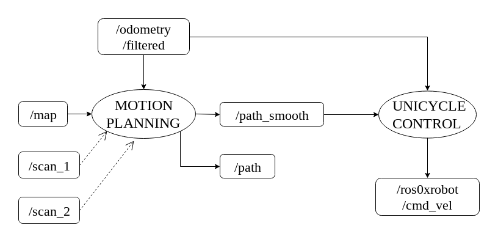

# Motion Planning and Control
Overview of the subsystem:

## Build and Working Status
|Node|Build Status|Working Status|Credits|Future Work|
|----|------------|--------------|-------|------|
|unicycle_controller|||[Recent Trends in Mobile Robots](http://www.worldscientific.com/doi/abs/10.1142/9789814354301_0005) (Code written from scratch.)| Tune controller gains.|
|rosserial_arduino (ESP32_IGVC)|| |[LED Stripe Driver](https://github.com/adafruit/Adafruit_NeoPixel) (Code written from scratch.) | Fix bugs with RC Manual control.|

## unicycle_controller

This node serves as the high-level controller for path following. It follows a non-linear control law based on unicycle vehicle dynamics, which our modified Firebird 0xDelta robot follows.

Based on C. Canudas de Wit., Nonlinear Control Design for Mobile Robots, in The International Journal of Robotics Research.

## ESP32_IGVC
This is repository for ESP32 code. For the hardware to communicate with ros, rosserial & rosserial_arduino needs to be installed and run. 
__Functions :__ LED Control, RC Receiver (Manual Control & E-Stop).

***Note: Built using platformio. To use / modify the code, install platformio (using vscode preferably) and import the project.***
